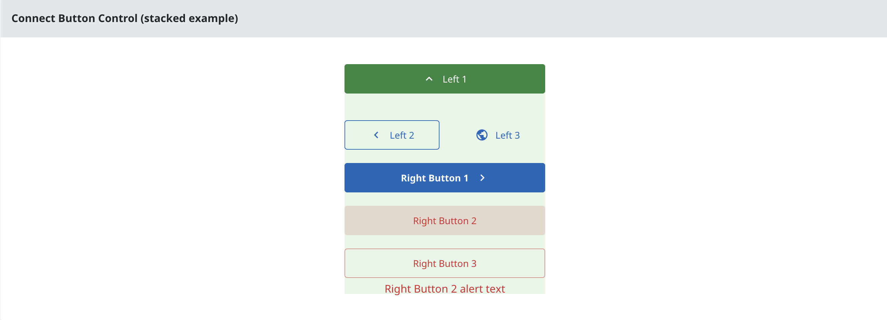

# Overview of @sbc-connect/nuxt-base
@sbc-connect/nuxt-base is a foundational Nuxt layer designed to provide a standardized set of configurations, components, and utilities for Connect applications.

## Included Features

### Configuration and Project Setup
This layer provides core configurations and setup elements, including:

- **Nuxt Modules:** Includes @nuxt/ui and @vueuse/nuxt modules.
- **Internationalization (i18n):** Pre-configured setup for multi-language support.
- **Base Alias:** Defines a `#base` alias to import from `base` from anywhere.
- **Runtime Configuration:** Minimum runtime configuration values.
- **Common Assets:** Common icons into the client bundle.
- **App Config:** Predefined NuxtUI defaults and custom Connect config

### BC Government Theme and Styling
Components for BC Government branding and styling:

- **BC Gov Theme:** Integration of the official BC Government theme.
- **Tailwind Presets:** Includes Tailwind CSS presets aligned with BC Gov design.
- **Branding:** Includes BC Gov logos, favicon, and BCSans font family with @font-face rules.

### Dependencies

- [Iconify MDI Icons](https://www.npmjs.com/package/@iconify/icons-mdi)
- [Nuxt UI](https://ui.nuxt.com/)
- [Nuxt I18n](https://i18n.nuxtjs.org/)
- [Vueuse Core](https://vueuse.org/)
- [Vueuse Nuxt](https://nuxt.com/modules/vueuse)
- [Dompurify](https://github.com/cure53/DOMPurify)
- [ES Toolkit](https://es-toolkit.dev/)
- [LaunchDarkly SDK](https://launchdarkly.com/docs/sdk/client-side/vue)
- [Maska](https://beholdr.github.io/maska/v3/#/vue)
- [Luxon](https://moment.github.io/luxon/#/?id=luxon)

### Components

- ConnectAddressDisplay
- ConnectHeader
- ConnectHeaderLogoHomeLink
- ConnectHeaderWhatsNew
- ConnectHeaderWrapper
- ConnectI18nHelper
- ConnectLayout
- ConnectModal
- ConnectSlideoverWhatsNew
- ConnectTransitionCollapse
- ConnectTransitionFade
- ConnectBCGovLogo
- ConnectBreadcrumb
- ConnectFooter
- ConnectInput
- ConnectInputDate
- ConnectLocaleSelect
- ConnectPageSection
- ConnectSpinner
- ConnectSystemBanner
- ConnectTextarea
- ConnectTombstone
- ConnectContactDisplay

#### ConnectButtonControl

Manage a group of action buttons via composable, find an example [here](../../../../packages/layers/forms/.playground/app/pages/examples/components/ConnectButtonControl/Stacked.vue).



**Child Components**
- ConnectButtonControlWrapper
- ConnectButtonControlButtons

### Composables

- useConnectModal
- useConnectLaunchDarkly
- useConnectTombstone

#### useConnectButtonControl

Manage a group of action buttons via composable, find an example [here](../../../../packages/layers/base/.playground/app/pages/examples/components/ConnectButtonControl/Stacked.vue).

### Layouts

- ConnectBase

### Standardized Pages

- **App.vue:**: App.vue configured with `lang` and `dir` attributes.
- **Error.vue:** An Error.vue page to handle 404 and unhandled errors.
- **Loading Template:** An spa-loading-template.html for application initialization.

### Utils

- appendUrlParam
- logFetchError
- parseSpecialCharacters
- setBreadcrumbs

### Plugins

- [Maska](https://beholdr.github.io/maska/v3/#/vue) input masks
- HTML sanitizer
- `What's New` Status API items, configurable with App Config.

### App Config

Customize the Connect app with the following App Config options.

```typescript
connect?: {
  header?: {
    localeSelect?: boolean
    whatsNew?: boolean
  }
  footer?: {
    versions?: string[]
  }
}
```

### Page Meta

Additional page meta:

```typescript
{
  breadcrumbs?: ConnectBreadcrumb[]
  hideBreadcrumbs?: boolean
}
```