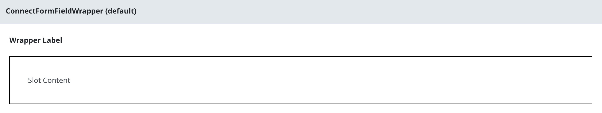

# Overview of @sbc-connect/nuxt-forms
@sbc-connect/nuxt-forms is designed to provide a standardized set of configurations, components, and utilities for Connect forms.

## Included Features

### Extended Layers
- [@sbc-connect/nuxt-base](../../../../packages/layers/base/README.md)

### Dependencies

- [@sbc-connect/nuxt-base](../../../../packages/layers/base/README.md)
- [Zod](https://zod.dev/)

### Components

#### ConnectButtonControl

Manage a group of action buttons via composable, find an example [here](../../../../packages/layers/forms/.playground/app/pages/examples/components/ConnectButtonControl/Stacked.vue).

**Child Components**
- ConnectButtonControlWrapper
- ConnectButtonControlButtons

#### ConnectFormAddress

Standardized form input elements for addresses, see an example [here](../../../../packages/layers/forms/.playground/app/pages/examples/components/ConnectFormAddress/index.vue). A full form usage example including the provided zod schemas [here](../../../../packages/layers/forms/.playground/app/pages/examples/forms/ConnectFormAddress/index.vue).

**Child Components**
- ConnectFormAddressCountry
- ConnectFormAddressStreet
- ConnectFormAddressStreetAdditional
- ConnectFormAddressCity
- ConnectFormAddressRegion
- ConnectFormAddressPostalCode
- ConnectFormAddressDeliveryInstructions

#### ConnectFieldset

Standard Connect fieldset layout, used to group related form inputs (e.g., address), allows for vertical or horizontal orientation, see an example [here](../../../../packages/layers/forms/.playground/app/pages/examples/components/ConnectFieldset/index.vue).

#### ConnectFormFieldWrapper

Standard Connect formfield wrapper, similar to a fieldset except **specifically** meant to contain one child element, please use a fieldset if grouping related form inputs. Allows for vertical or horizontal orientation, see an example [here](../../../../packages/layers/forms/.playground/app/pages/examples/components/ConnectFormFieldWrapper/index.vue).

#### Other

- ConnectFormInput
- ConnectFormTextarea

### Composables

#### useButtonControl

Manage a group of action buttons via composable, find an example [here](../../../../packages/layers/forms/.playground/app/pages/examples/components/ConnectButtonControl/Stacked.vue).

#### useCanadaPost

Canada Post Address Complete. Attach to an input element by providing the input id. Requires `NUXT_PUBLIC_ADDRESS_COMPLETE_KEY` env variable. See an example [here](../../../../packages/layers/forms/app/components/Connect/Form/Address/Street.vue).

### Layouts

- ConnectForm

### Utils

- **isoCountriesList**
- **getRequiredAddressSchema:** Zod schema for required addresses.
- **getNonRequiredAddressSchema:** Zod schema for optional addresses (additional validation may be required to prevent incomplete addresses).